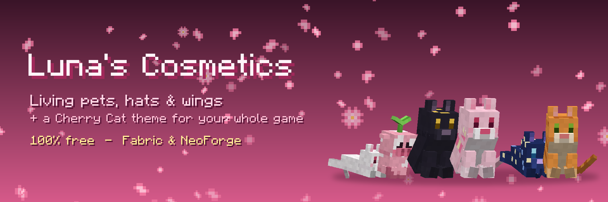
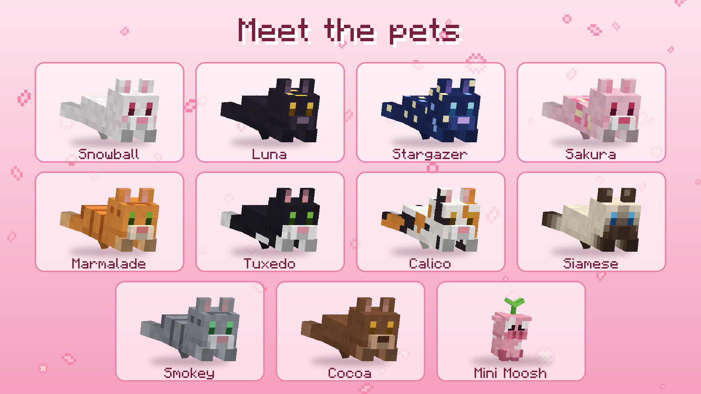

<p align="center"></p>

# Luna's Cosmetics

A free wardrobe of **living pets, hats and wings** for Minecraft, plus an optional **Cherry Cat theme** for the whole game. Everything is unlocked for everyone — no store, no coins.

- **Fabric 1.21.11** → `fabric-1.21.11/`
- **NeoForge 1.21.1** → `neoforge-1.21.1/`

Download the latest jars from [Releases](https://github.com/AttackStudios/lunascosmetics/releases). The full feature tour lives in [MODRINTH.md](MODRINTH.md).

<p align="center"></p>

## Features

- 10 animated cats + **Mini Moosh** that ride on your head or shoulder — they blink, look around, twitch their ears, knead, nap and purr
- Hats (Sakura Crown, Kitty Ears ×3, Star Halo) and back pieces (Petal Wings)
- A wardrobe with a live 3D preview (cherry cat button next to *Options*, or **K**)
- **Custom cosmetics**: drop Blockbench `.bbmodel` files into `config/lunascosmetics/custom/` (`hat_` / `pet_` / `back_` prefixes)
- **Sync** between everyone with the mod — through the server if it has the mod, or the optional relay in `relay/`
- **Cherry Cat theme**: pink GUI, petals, paw cursor, hover ears, mew clicks, title-screen cat
- **Auto-update** from this repo's GitHub releases (checksummed, applied after the game closes; can be turned off)

## Building

```sh
cd fabric-1.21.11 && ./gradlew build     # -> build/libs/lunascosmetics-fabric-1.21.11-<ver>.jar
cd neoforge-1.21.1 && ./gradlew build    # -> build/libs/lunascosmetics-neoforge-1.21.1-<ver>.jar
```

Both need JDK 21.

## Releasing (auto-update)

The in-game updater reads `https://api.github.com/repos/AttackStudios/lunascosmetics/releases/latest` and picks the asset whose name starts with `lunascosmetics-fabric-1.21.11-` or `lunascosmetics-neoforge-1.21.1-`. So to ship an update:

1. Bump `mod_version` in both `gradle.properties`
2. Build both
3. `gh release create v<ver> fabric-1.21.11/build/libs/*.jar neoforge-1.21.1/build/libs/*.jar`

## Art pipeline

Models live in `src/main/resources/assets/lunascosmetics/models/cosmetic/*.json` and are shared by the mod and the Python tools:

- `tools/art.py` — paints every cosmetic texture with 3D-aware patterns, plus GUI sprites
- `tools/theme_sprites.py` — recolours vanilla GUI art into the Cherry Cat theme
- `tools/lunamodel.py` — model loader + a tiny software renderer for previews
- `tools/media.py` — icon, banner and gallery images in `media/`

## Relay

`relay/server.js` is an optional ~100-line WebSocket relay for servers that don't run the mod: `npm install && PORT=8091 node server.js`, then set *Settings → Sync relay* to `ws://host:8091`.

## License

MIT — see [LICENSE](LICENSE).
